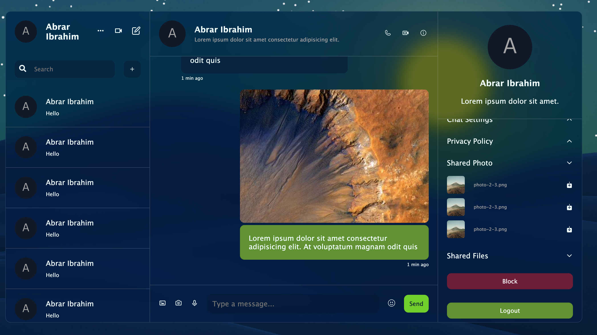
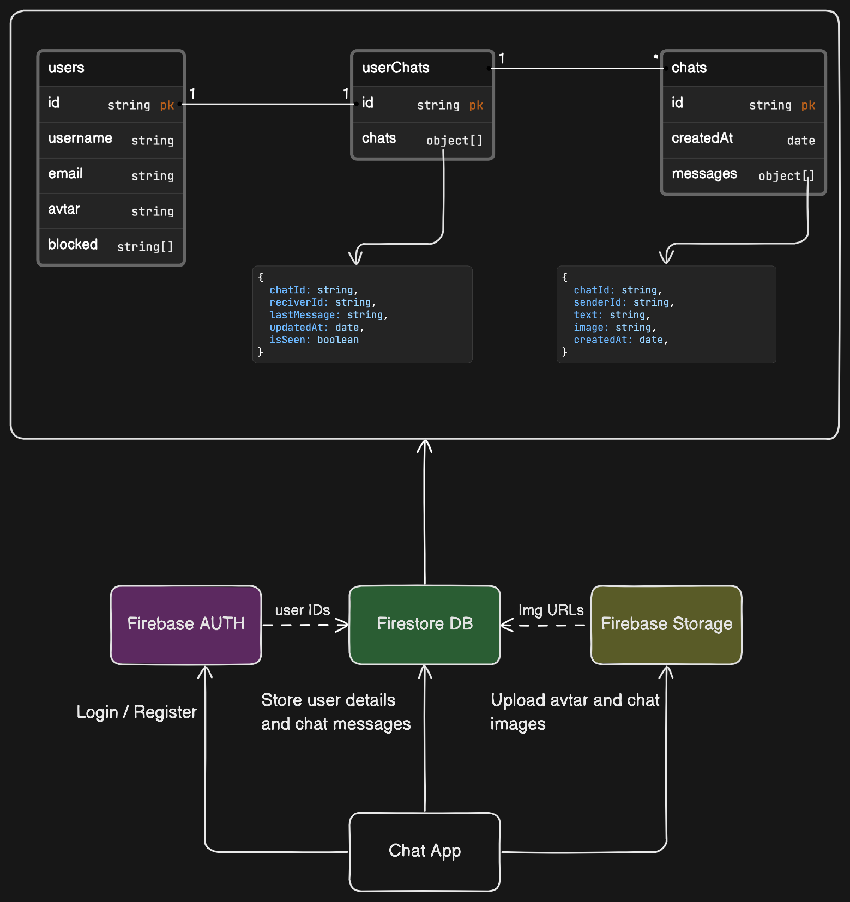

**Chat Web App**

This is a simple chat web application built using React, Vite, Firebase, and Zustand for state management. Firebase services such as Authentication, Firestore for the database, and Storage for storing files are utilized in this application.

## Features

- User authentication with Firebase Authentication.
- Real-time chat functionality using Firestore.
- Ability to send and receive messages.
- Image upload functionality using Firebase Storage.
- Simple state management with Zustand.

## Prerequisites

Before running the application, you need to have the following installed on your machine:

- Node.js
- npm or yarn

## Installation

1. Clone this repository to your local machine.
2. Navigate to the project directory.
3. Run `npm install` or `yarn install` to install the dependencies.

## Firebase Configuration

1. Create a Firebase project on the Firebase console (https://console.firebase.google.com/).
2. Enable Authentication, Firestore, and Storage services in your Firebase project.
3. Copy your Firebase project configuration.
4. Create a `.env` file in the root directory of the project.
5. Add your Firebase configuration to the `.env` file:

```
VITE_API_KEY=your_api_key

```

## Running the Application

1. After completing the installation and Firebase configuration, run `npm run dev` or `yarn run dev` to start the development server.
2. Open your browser and navigate to `http://localhost:5173` to view the application.

## Screenshots



## Application Architecture



## Credits

- This project was bootstrapped with [Vite](https://vitejs.dev/).
- Firebase - for Authentication, Firestore, and Storage services.
- Zustand - for state management.
- [Lamadev](https://www.youtube.com/watch?v=domt_Sx-wTY) for idea.

## License

This project is licensed under the MIT License - see the [LICENSE](LICENSE) file for details.
